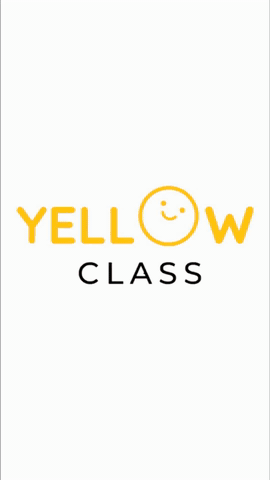
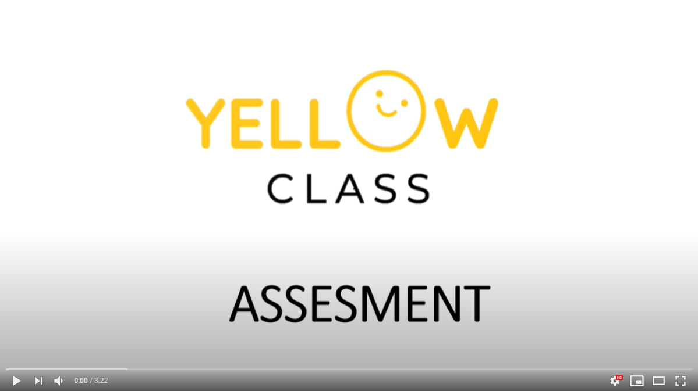

# Yellow Class Flutter Assessment

A User Friendly Application to Stream Educational videos for kids.It has different category to nurture your childs future.



## Problem Statement

Build a simple application using Flutter compatible with Android/iOS devices and Android TV.

 Build a simple Flutter app to play a video in fullscreen landscape mode with a slider bar to control the volume in the video.
 Stream the users devices front camera feed (if exists) in a small box above the video player on the bottom right corner of the screen.

Bonus points if you

 Allow the user to drag the webcam feed widget around on the screen.
 Build persistent firebase authentication.

Feel free to do more than mentioned above for more bonus points.


## Features of the App
1. STREAM VIDEOS (landscape mode) - Volume controller - playback time controller - Play and pause controller 
1. WEBCAM VIEW - draggable widget
1. LOGIN - Firebase Authentication
1. LISTVIEW (Collection of video streams categorised)
1. DRAWER SCREEN -  user details

## Demo video

[](https://youtu.be/r0ayIUyf6ug)

## Run App

1. Install the flutter SDK and add it to you path - [Flutter SDK](https://flutter.dev/docs/get-started/install)
Goto the yelloclass_assesment(yellowclass_assesment) and 
Run the following command in the terminal

```bash
flutter run
```

Note - 9999999999 is the Phone number for testing purpose
       123456 is the password
